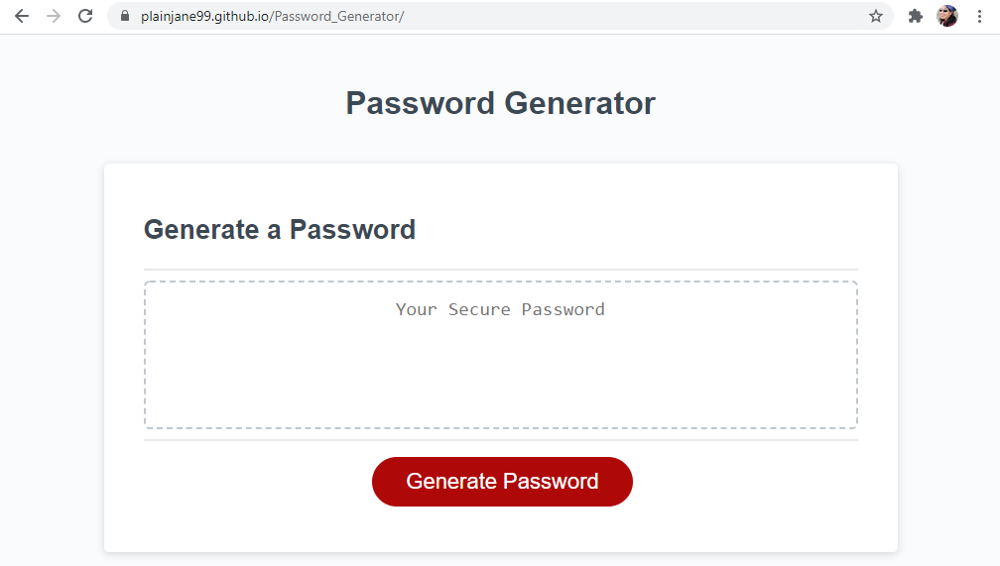

# Week 3 Challenge - Password Generator

## Table of Contents

* [Deployment](#deploy)
* [Description of Challenge](#description)
* [Execution of the Challenge](#execution)
* [Lessons Learned](#lessons)
* [More A-ha in the Future, aka Challenges to Get Over](#challenges)

## Deployment 

* The challenge is deployed at the following live URL:
https://plainjane99.github.io/Password_Generator/

You should see the following:

* The application code for this challenge is located at the following GitHub repository:
https://github.com/plainjane99/Password_Generator

## Description of Challenge 

The Week 3 Challenge for the UCLA Extension Full Stack Development Bootcamp was to create a password generator by writing the javascript file.  The code for the html and css was included as starter code. The acceptance criteria included:  

* Write the javascript for the password generator to do the following:
    * Allow the user to answer a series of prompts that will provide the criteria for the password characters.
    * The user must provide the length of the password to be generated.
    * The valid password characters are lowercase, uppercase, numbers, and special characters.  The user may choose or not choose any set of characters.
    * The password generated must include at least one character of any set requested by the user.
    * The password must generate in the password generator box.

Once the acceptance criteria were met, the challenge was to be deployed to a live URL through GitHub and to have the webpage load with no errors.  

## Execution of the Challenge 

Overall, I found this to be another excellent challenge.  After completing the lessons, I did not feel that I would be able to complete this challenge very quickly.  The Robot Gladiator game that we created through the lessons had many conditional and loop statements that were somewhat difficult to follow.  Using the console tab on Dev Tools helped a little, but it still felt overwhelming.  I started this challenge by pseudo-coding what the code was supposed to do and just started typing out variables and functions.  By the end of the first night I worked on the challenge, I felt I had a good start to the code.  I attended office hours the next day to get help on the aspects of my code that were not working and the TA commented that what I had started was good but there was an aspect that I was missing.  The TA talked me through the pseudo-code of what I was missing and again I felt overwhelmed.  After office hours ended, I began coding to the new pseudo-code and, surprisingly, everything went fairly smoothly.  I completed the code much more quickly than I expected.  

One additional comment regarding the "git commit" portion of this challenge.  The criteria included having multiple commits to the repository.  I found it more difficult to find a good place to commit since it felt like the work was always in progress.  There were no "enhancements" per se, so no additional code commits when the code was actually working.  All of my commits are just stages of getting the challenge completed and the successive work to get the challenge completed.  I would be interested in learning where else I could have done a commit.

## Lessons Learned 

The biggest lesson learned from this lesson was how valuable pseudo-code can be, however, it is only valuable if the pseudo-code is right.  When I created my own pseudo-code, it took me in not quite the right direction.  The TA was able to pick up on this right away and was able to give me a heading check.  I learned that having a full understanding of what the code needs to do is especially important to pseudo-code correctly.

Other aspects that I was able to learn through the execution of this challenge include:

1. Global versus local variables - Although the difference has been stated in the lesson material as well as in class, I still got caught making the mistake of using local variables instead of global variables.  After troubleshooting for at least a couple hours, and the help of fellow classmates, I don't think I will make the mistake again.

2. Console tab of Chrome Developer Tools - Using the console tab of the Chrome Developer Tools for the Robot Gladiators game was a bit confusing.  I think I learned a lot more about using this tool by going through the more simple code of the Password Generator.  I learned exactly how and where to use the debugger statement.  I learned how to use the Watch window and how to incrementally step through the code.

3.  Conditional and Loop statements - The bulky code of the Robot Gladiators game made the conditional and loop statements overwhelming to understand but the simpler code of this challenge did an excellent job in providing a basic understanding of how to write the statements. 

4.  Git and GitHub - This challenge solidified my understanding of how to create my local Git repository and remote GitHub repository and linking the two.

## More A-ha in the Future, aka Challenges to Get Over 

The challenges I know I have ahead of me include:
1. Learning the logic, and therefore the simplest way, to write javascript.

Thanks for reading this README.md.